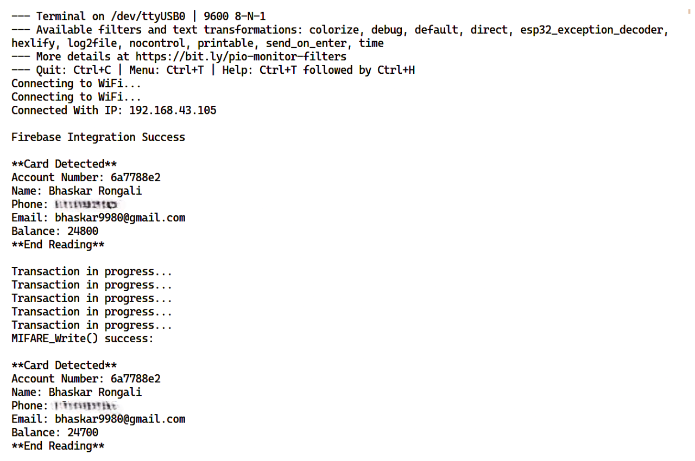

# BlockPay

BlockPay is a secure and efficient contactless payment system that utilizes bidirectional blockchain technology for recording transactions. This project consists of two folders: PaymentSystem and SmartBlock.

## Abstract

The growth of the Internet of Things (IoT) has increased the demand for contactless payments via IoT devices. However, existing centralized transaction management systems in the IoT suffer from communication overhead and security issues. Blockchain technology provides a promising solution, but current blockchain-based payment systems lack security and scalability. To address these challenges, BlockPay proposes a bidirectional blockchain with the Committee Member Auction (CMA) consensus mechanism, offering secure and scalable contactless payments in the IoT.

## PaymentSystem

The PaymentSystem folder contains the code for contactless payment using an ESP32 microcontroller and an RC522 RFID reader. This folder implements the hardware and software components necessary for secure contactless payments in the Internet of Things (IoT) environment. The PaymentSystem utilizes the MFRC522 library for interfacing with the RFID reader and provides a user-friendly interface for initiating and processing payments.

To set up and use the PaymentSystem:

1. Connect the ESP32 microcontroller to the RC522 RFID reader.
2. Install the necessary dependencies by following the instructions in the README file located in the PaymentSystem folder.
3. Compile and upload the code to the ESP32 microcontroller.
4. Run the PaymentSystem and follow the on-screen instructions to perform contactless payments.

### Payment System Built using ESP32 and RC522 RFID Reader

  

### The Payment System facilitating seamless transaction processing

  

## SmartBlock

The SmartBlock folder contains the implementation of a novel bidirectional blockchain using C++. The bidirectional blockchain offers enhanced security and scalability for resource-constrained IoT devices. It introduces a new consensus mechanism called Committee Member Auction (CMA) and utilizes the Blake and Chameleon hash functions for efficient and secure transaction processing.

To set up and use SmartBlock:

1. Navigate to the SmartBlock folder.
2. Follow the instructions in the README file to compile and run the SmartBlock blockchain.
3. Interact with the SmartBlock blockchain by initiating transactions, querying the ledger, and participating in the consensus mechanism.

### SmartBlock recording the transactions in its bidirectional blockchain system.

  

## Flow of Control 

When an RFID card is tapped on the RC522 reader, user data is transmitted to the ESP32. Using its WiFi module, the ESP32 sends the sender's address, receiver's address, and transaction amount to Firebase. The blockchain network monitors Firebase for new transactions. Upon recording a new transaction in Firebase, a corresponding record is created in the blockchain to store the transaction data. The smart card balance is then updated by deducting the transaction amount. 

  

## Key Features

- Contactless payment system using ESP32 and RC522 RFID reader
- Implementation of a bidirectional blockchain with enhanced security and scalability
- Committee Member Auction (CMA) consensus mechanism
- Utilization of Blake and Chameleon hash functions for efficient transaction processing

## Installation and Usage

1. Clone the repository
2. Navigate to the respective folders: `cd BlockPay/PaymentSystem` or `cd BlockPay/SmartBlock`
3. Follow the instructions provided in the README files within each folder for setup and usage details.

## Contributing

Contributions are welcome! Contributions can include bug fixes, feature implementations, and documentation improvements. Before making a contribution, please make sure to review the existing issues and pull requests to avoid duplication of effort.

## License

This project is licensed under the [MIT License](LICENSE). Feel free to modify and distribute it according to the terms of the license.
